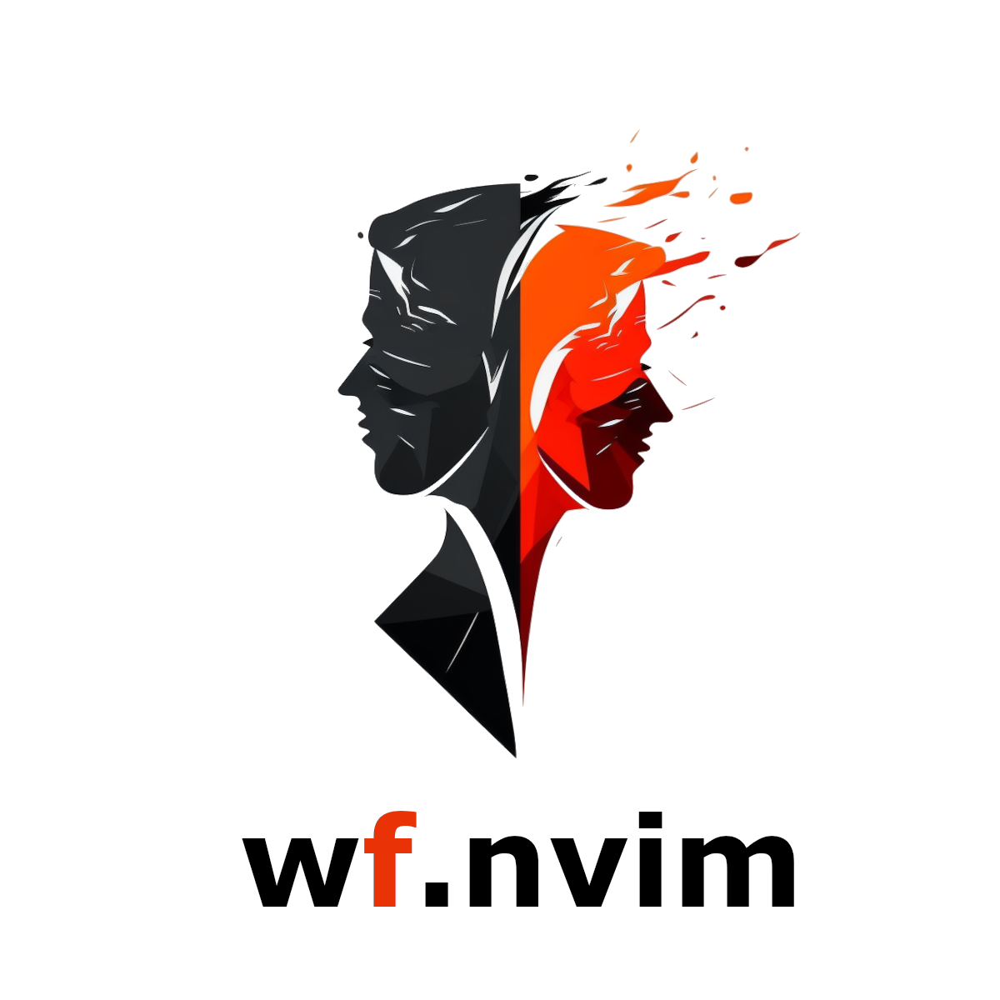

<a name="readme-top"></a>

[![Contributors][contributors-shield]][contributors-url]
[![Forks][forks-shield]][forks-url]
[![Stargazers][stars-shield]][stars-url]
[![Issues][issues-shield]][issues-url]
[![MIT License][license-shield]][license-url]
[![Build Status][ci-shield]][ci-url]

<br />
<div align="center">
  <a href="https://github.com/Cassin01/wf.nvim">
    <!--  -->
    
  </a>

  <!-- <h3 align="center">wf.nvim</h3> -->

  <p align="center">
    <!-- A which-key with a fuzzy-find. -->
    <br />
    <a href="https://github.com/Cassin01/wf.nvim/blob/main/doc/wf.txt"><strong>Explore the docs »</strong></a>
    <br />
    <br />
    <a href="https://youtu.be/S3aKshSPyiQ">View Demo</a>
    ·
    <a href="https://github.com/Cassin01/wf.nvim/issues">Report Bug</a>
    ·
    <a href="https://github.com/Cassin01/wf.nvim/issues">Request Feature</a>
  </p>
</div>

<!-- TABLE OF CONTENTS -->
<!-- <details> -->
  <summary>Table of Contents</summary>
  <ol>
    <li>
      <a href="#about-the-project">About The Project</a>
    </li>
    <li><a href="#installation">Installation</a></li>
    <li><a href="#getting-started">Getting started</a></li>
    <li><a href="#configuration">Configuration</a></li>
    <li><a href="#key-bindings-assignments">Default Shortcut / Key
    Bindings Assignments</a></li>
    <li><a href="#documentation">Documentation</a></li>
    <li><a href="#contributing">Contributing</a></li>
    <li><a href="#license">License</a></li>
    <li><a href="#credits">Credits</a></li>
  </ol>
<!-- </details> -->

<!-- ABOUT THE PROJECT -->
## About The Project

<div align="center">
    <!-- > Drag your video (<10MB) here to host it for free on GitHub. -->

<!-- [![Product Name Screen Shot][product-screenshot]](https://github.com/Cassin01/wf.nvim) -->

https://user-images.githubusercontent.com/42632201/219690019-a5615bac-6747-41d8-a10e-ddae151af5c2.mp4

</div>

<div align="center">

<!-- > Videos don't work on GitHub mobile, so a GIF alternative can help users. -->

[The video link for mobile users](https://youtu.be/S3aKshSPyiQ)

</div>

`wf.nvim` is a new which-key like plugin for Neovim.

### ✨ Features
* Builtin fuzzy-finder
* Using `nvim_set_keymap`'s "desc" feature (see `:help nvim_set_keymap`)
* Skip duplicate characters (`skip_front_duplication`, `skip_back_duplication`)
* Builtin pickers (`which-key`, `mark`, `bookmark`, `buffer`, `register`)

### ✨ The difference with [which-key.nvim](https://github.com/folke/which-key.nvim)

*Pros*  
- You can use the builtin fuzzy finder to find forgotten shortcuts.
- Three themes(default, space, chad) are offered.
    - `which-key.nvim` is one theme.
- Fits any color scheme.
    - The colors change to match the color scheme.
- Stress-free selection even when long letters are available as options.
    - See `skip_front_duplication` and `skip_back_duplication` at the document.
- Modal selection is made possible by adopting an event-driven architecture instead of waiting for a key with a while loop.

*Cons*  
- Slower processing speed for larger number of runtime process

<p align="right">(<a href="#readme-top">back to top</a>)</p>

## Installation

<!-- <div align="center"> -->
<table>
<thead>
<tr>
<th>Package manager</th>
<th>Snippet</th>
</tr>
</thead>
<tbody>
<tr>
<td>

[wbthomason/packer.nvim](https://github.com/wbthomason/packer.nvim)

</td>
<td>

```lua
-- stable version
use {"wf.nvim", tag = "*", config = function() require("wf").setup() end}
-- dev version
use {"wf.nvim", config = function() require("wf").setup() end}
```

</td>
</tr>
<tr>
<td>

[junegunn/vim-plug](https://github.com/junegunn/vim-plug)

</td>
<td>

```vim
call plug#begin()
-- stable version
Plug "wf.nvim", { "tag": "*" }
-- dev version
Plug "wf.nvim"
call plug#end()

lua << EOF
require("wf").setup()
EOF
```

</td>
</tr>
<tr>
<td>

[folke/lazy.nvim](https://github.com/folke/lazy.nvim)

</td>
<td>

```lua
-- stable version
require("lazy").setup({{"wf.nvim", version = "*", config = function() require("wf").setup() end}})
-- dev version
require("lazy").setup({{"wf.nvim", config = function() require("wf").setup() end}})
```

</td>
</tr>
</tbody>
</table>
<!-- </div> -->

<p align="right">(<a href="#readme-top">back to top</a>)</p>

## Getting started

There is no required dependencies on `wf.nvim` but Neovim >= 0.8.1 and
[nvim-web-devicons](https://github.com/nvim-tree/nvim-web-devicons) is recommended
for enjoying all the features of `wf.nvim`.


<!-- <details> -->
  <summary>Minimal Setup</summary>

```lua
local which_key = require("wf.builtin.which_key")
local register = require("wf.builtin.register")
local bookmark = require("wf.builtin.bookmark")
local buffer = require("wf.builtin.buffer")
local mark = require("wf.builtin.mark")

-- Register
vim.keymap.set(
  "n",
  "<Space>wr",
  register(),
  { noremap = true, silent = true, desc = "[wf.nvim] register" }
)

-- Bookmark
vim.keymap.set(
  "n",
  "<Space>wbo",
  bookmark({
    nvim = "~/.config/nvim",
    zsh = "~/.zshrc",
  })
  { noremap = true, silent = true, desc = "[wf.nvim] bookmark" }
)

-- Buffer
vim.keymap.set(
  "n",
  "<Space>wbu",
  buffer({}),
  {noremap = true, silent = true, desc = "[wf.nvim] buffer"}
)

-- Mark
vim.keymap.set(
    "n"
    "'"
    mark(),
    {nowait = true, noremap = true, silent = true, desc = "[wf.nvim] mark"}
)

-- Which Key
vim.keymap.set(
  "n",
  "<Leader>",
  which_key({ text_insert_in_advance = "<Leader>" }),
  { noremap = true, silent = true, desc = "[wf.nvim] which-key /", }
)
```

If you are concerned about the lag between pressing the shortcut that activates `which-key` and the actual activation of `which-key`, you can put the `nowait` option in the keymap. (Not recommended.)

However, in order for the key to be invoked nowait, the shortcut to invoke `which-key` must be at the end of the init.lua file.
Below is an example of using timeout to delay the registration of the shortcut that activates `which-key`.

```lua
-- set keymaps with `nowait`
-- see `:h :map-nowait`
local function timeout(ms, callback)
  local uv = vim.loop
  local timer = uv.new_timer()
  local _callback = vim.schedule_wrap(function()
    uv.timer_stop(timer)
    uv.close(timer)
    callback()
  end)
  uv.timer_start(timer, ms, 0, _callback)
end
timeout(100, function()
  vim.keymap.set(
    "n",
    "<Leader>",
    which_key({ text_insert_in_advance = "<Leader>" }),
    { noremap = true, silent = true, desc = "[wf.nvim] which-key /", }
  )
end)
vim.api.nvim_create_autocmd({"BufEnter", "BufAdd"}, {
  group = vim.api.nvim_create_augroup("my_wf", { clear = true }),
  callback = function()
    timeout(100, function()
      vim.keymap.set(
        "n",
        "<Leader>",
        which_key({ text_insert_in_advance = "<Leader>" }),
        { noremap = true, silent = true, desc = "[wf.nvim] which-key /", buffer = true })
    end)
  end
})
```

<!-- </details> -->

<!-- > Describe how to use the plugin the simplest way -->

<p align="right">(<a href="#readme-top">back to top</a>)</p>

## Configuration

<!-- > The configuration list sometimes become cumbersome, making it folded by default reduce the noise of the README file. -->

<!-- <details> -->
<!-- <summary>Click to unfold the full list of options with their default values</summary> -->

<!-- > **Note**: The options are also available in Neovim by calling `:h wf.options` -->

```lua
require("wf").setup({
  theme = "default",
    -- you can copy the full list from lua/wf/setup/init.lua
})
```

<!-- </details> -->

<p align="right">(<a href="#readme-top">back to top</a>)</p>

## Key Bindings Assignments

The default key assignments are shown in the table below.

| Mode | Key | Action |
| - | - | - |
| Normal, Insert | `<c-t>` | Toggle the which-key with the fuzzy-find |
| Normal | `<esc>` | Close wf.nvim |
| Normal | `<c-c>` | Close wf.nvim |


<p align="right">(<a href="#readme-top">back to top</a>)</p>

## Documentation

You can find guides for the plugin on [the document](https://github.com/Cassin01/wf.nvim/blob/main/doc/wf.txt).

<p align="right">(<a href="#readme-top">back to top</a>)</p>

## Tips

### Holding specific key pattern on which_key

It may be a bit arrogant to call it tips, but here is my init.lua setup.

```lua
-- setup table for prefixes
---------------------------------------
if _G.__key_prefixes == nil then
  _G.__key_prefixes = {
    n = {},
    i = {},
  }
end


-- utility function for setting keymaps
---------------------------------------
local function nmaps(prefix, desc, tbl)
  local sign = "["..name.."]"
  table.insert(_G.__key_prefixes["n"], prefix, sign)
  local set = function(key, cmd, desc, opt)
    local _opt = opt or {}
    _opt["desc"] = desc..sign
    _opt["noremap"] = true
    vim.keymap.set("n", prefix .. key, cmd, _opt)
  end
  for _, v in ipairs(tbl)  do
    set(unpack tbl)
  end
end


-- set keymap for each plugins
---------------------------------------
-- lambdalisue/fern.vim
nmaps("<space>n", "fern",
{{"p", "<cmd>Fern . -drawer -toggle<cr>", "open fern on a current working directory"},
 {"d", "<cmd>Fern %:h -drawer -toggle<cr>", "open fern on a parent directory of a current buffer"}})

-- nvim-telescope/telescope.nvim
nmaps("<space>t", "telescope"
{{"f", "<cmd>Telescope find_files<cr>", "find files"},
 {"g", "<cmd>Telescope live_grep<cr>", "live grep"},
 {"b", "<cmd>Telescope buffers<cr>", "buffers"},
 {"h", "<cmd>Telescope help_tags<cr>", "help tags"},
 {"t", "<cmd>Telescope<cr>", "telescope"},
 {"o", "<cmd>Telescope oldfiles<cr>", "old files"},
 {"r", "<cmd>Telescope file_browser<cr>", "file_browser"}})


-- set keymap for calling which-key
---------------------------------------
vim.set.keymap("n", "<Space>",
which_key({text_insert_in_advance="<space>", key_group_dict=_G.__key_prefixes["n"]}),
{noremap = true, silent = tre, desc = "which-key space", nowait = true})
```


<p align="right">(<a href="#readme-top">back to top</a>)</p>

<!-- CONTRIBUTING -->
## Contributing

Contributions are what make the open-source community such an amazing place to learn, inspire, and create. Any contributions you make are **greatly appreciated**.

If you have a suggestion that would make this better, please fork the repo and create a pull request. You can also simply open an issue with the tag "enhancement".
Don't forget to give the project a star! Thanks again!

Development flow basically follows [git-flow](https://nvie.com/posts/a-successful-git-branching-model/).

1. Fork the Project
2. Create your Feature Branch (`git checkout -b feature/AmazingFeature`)
3. Generate document, format codes and test codes (`make push`)
4. Commit your changes (`git commit -m 'Add some AmazingFeature'`)
5. Push to the Branch (`git push origin feature/AmazingFeature`)
6. Open a Pull Request

<p align="right">(<a href="#readme-top">back to top</a>)</p>

<!-- LICENSE -->
## License

Distributed under the MIT License. See `LICENSE.txt` for more information.

<p align="right">(<a href="#readme-top">back to top</a>)</p>

## Credits

### CI, README
- [shortcuts/neovim-plugin-boilerplate](https://github.com/shortcuts/neovim-plugin-boilerplate)
- [echasnovski/mini.nvim](https://github.com/echasnovski/mini.nvim)
- [othneildrew/Best-README-Template](https://github.com/othneildrew/Best-README-Template)
### Picker
- [nvim-telescope/telescope.nvim](https://github.com/nvim-telescope/telescope.nvim)
- [folke/which-key.nvim](https://github.com/folke/which-key.nvim)
- [liuchengxu/vim-which-key](https://github.com/liuchengxu/vim-which-key)
### Which-key
- [justbuf/emacs-which-key](https://github.com/justbur/emacs-which-key)
- [helix-editor/helix](https://github.com/helix-editor/helix)
- [syl20bnr/spacemacs](https://github.com/syl20bnr/spacemacs)
### Theme
- [NvChad/NvChad](https://github.com/NvChad/NvChad)

### buffer-switcher

- [matbme/JABS.nvim](https://github.com/matbme/JABS.nvim)

<!-- > If alternatives of your plugin exist, you can provide some pros/cons of using yours over the others. -->

<p align="right">(<a href="#readme-top">back to top</a>)</p>


<!-- MARKDOWN LNIKS & IMAGES -->
[contributors-shield]: https://img.shields.io/github/contributors/Cassin01/wf.nvim.svg?style=for-the-badge
[contributors-url]: https://github.com/Cassin01/wf.nvim/graphs/contributors
[forks-shield]: https://img.shields.io/github/forks/Cassin01/wf.nvim.svg?style=for-the-badge
[forks-url]: https://github.com/Cassin01/wf.nvim/network/members
[stars-shield]: https://img.shields.io/github/stars/Cassin01/wf.nvim.svg?style=for-the-badge
[stars-url]: https://github.com/Cassin01/wf.nvim/stargazers
[issues-shield]: https://img.shields.io/github/issues/Cassin01/wf.nvim.svg?style=for-the-badge
[issues-url]: https://github.com/Cassin01/wf.nvim/issues
[license-shield]: https://img.shields.io/github/license/Cassin01/wf.nvim.svg?style=for-the-badge
[license-url]: https://github.com/Cassin01/wf.nvim/blob/main/LICENSE.txt
[ci-shield]: https://img.shields.io/github/actions/workflow/status/Cassin01/wf.nvim/main.yml?style=for-the-badge
[ci-url]: https://github.com/Cassin01/wf.nvim/actions/workflows/main.yml
[document-shield]: https://img.shields.io/github/actions/workflow/status/Cassin01/wf.nvim/main.yml?style=for-the-badge
[document-url]: https://github.com/Cassin01/wf.nvim/actions/workflows/main.yml
[product-screenshot]: https://user-images.githubusercontent.com/42632201/213849418-3cddb8bb-7323-4af7-b201-1ce2de07d3b9.png
[product-video]: .github/images/theme.mp4
