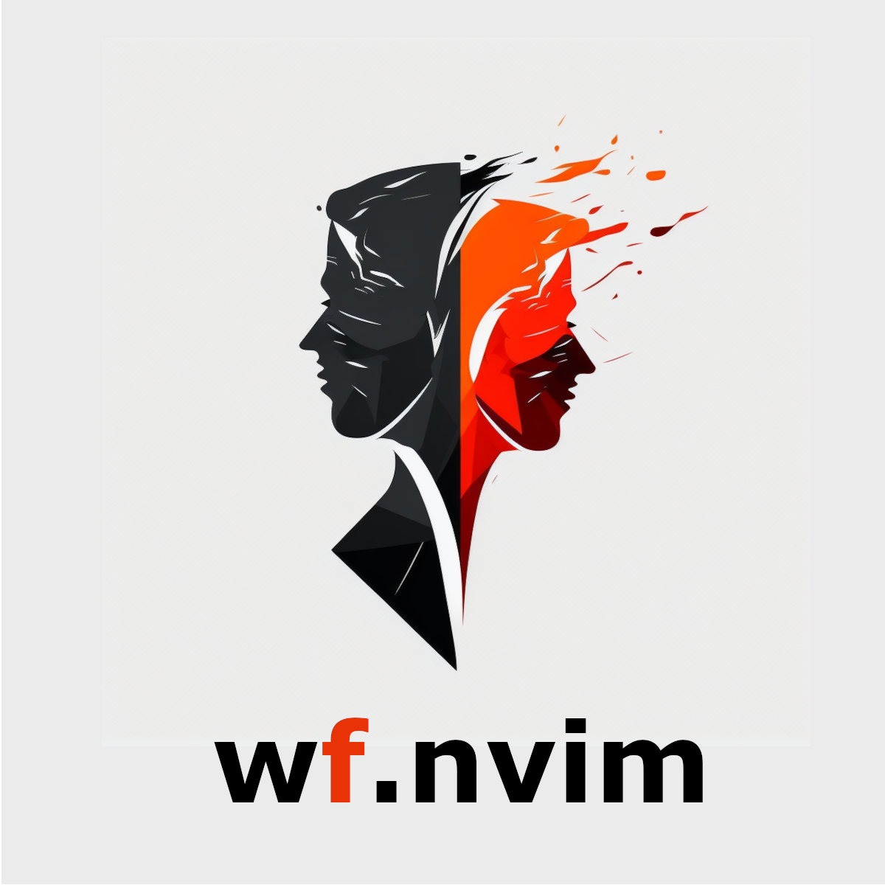

<a name="readme-top"></a>

[![Contributors][contributors-shield]][contributors-url]
[![Forks][forks-shield]][forks-url]
[![Stargazers][stars-shield]][stars-url]
[![Issues][issues-shield]][issues-url]
[![MIT License][license-shield]][license-url]
[![Build Status][ci-shield]][ci-url]

<br />
<div align="center">
  <a href="https://github.com/Cassin01/wf.nvim">
    <!--  -->
    
  </a>

  <!-- <h3 align="center">wf.nvim</h3> -->

  <p align="center">
    <!-- A which-key with a fuzzy-find. -->
    <br />
    <a href="https://github.com/Cassin01/wf.nvim"><strong>Explore the docs »</strong></a>
    <br />
    <br />
    <a href="https://github.com/Cassin01/wf.nvim">View Demo</a>
    ·
    <a href="https://github.com/Cassin01/wf.nvim/issues">Report Bug</a>
    ·
    <a href="https://github.com/Cassin01/wf.nvim/issues">Request Feature</a>
  </p>
</div>

<!-- TABLE OF CONTENTS -->
<details>
  <summary>Table of Contents</summary>
  <ol>
    <li>
      <a href="#about-the-project">About The Project</a>
    </li>
    <li><a href="#installation">Installation</a></li>
    <li><a href="#getting-started">Getting started</a></li>
    <li><a href="#configuration">Configuration</a></li>
    <li><a href="#Wiki">Wiki</a></li>
    <li><a href="#contributing">Contributing</a></li>
    <li><a href="#license">License</a></li>
    <li><a href="#contact">Contact</a></li>
    <li><a href="#motivations">Motivations</a></li>
  </ol>
</details>

<!-- ABOUT THE PROJECT -->
## About The Project

<div align="center">
    <!-- > Drag your video (<10MB) here to host it for free on GitHub. -->

<!-- [![Product Name Screen Shot][product-screenshot]](https://github.com/Cassin01/wf.nvim) -->
[![Product Name Screen Shot][product-video]](https://youtu.be/S3aKshSPyiQ)

</div>

<div align="center">

<!-- > Videos don't work on GitHub mobile, so a GIF alternative can help users. -->

_[GIF version of the showcase video for mobile users](SHOWCASE_GIF_LINK)_

</div>

This plugin is yet another `vim.ui.select` alternative. This plugin also provides `which-key`, `marker`, `bookmark`, `buffer` pikers.

Here's why:
* You can use fuzzy find when searching docs.
* Neovim's "docs" feature.
* You can skip duplicate characters.

Have a ball!

<p align="right">(<a href="#readme-top">back to top</a>)</p>

## Installation

<div align="center">
<table>
<thead>
<tr>
<th>Package manager</th>
<th>Snippet</th>
</tr>
</thead>
<tbody>
<tr>
<td>

[wbthomason/packer.nvim](https://github.com/wbthomason/packer.nvim)

</td>
<td>

```lua
-- stable version
use {"wf", tag = "*", config = function() require("wf").setup() end}
-- dev version
use {"wf", config = function() require("wf").setup() end}
```

</td>
</tr>
<tr>
<td>

[junegunn/vim-plug](https://github.com/junegunn/vim-plug)

</td>
<td>

```vim
call plug#begin()
-- stable version
Plug "wf", { "tag": "*" }
-- dev version
Plug "wf"
call plug#end()

lua << EOF
require("wf").setup()
EOF
```

</td>
</tr>
<tr>
<td>

[folke/lazy.nvim](https://github.com/folke/lazy.nvim)

</td>
<td>

```lua
-- stable version
require("lazy").setup({{"wf", version = "*", config = function() require("wf").setup() end}})
-- dev version
require("lazy").setup({{"wf", config = function() require("wf").setup() end}})
```

</td>
</tr>
</tbody>
</table>
</div>

<p align="right">(<a href="#readme-top">back to top</a>)</p>

## Getting started

<details>
  <summary>Minimal Setup</summary>

```lua
local which_key = require("wf.builtin.which_key")
local register = require("wf.builtin.register")
local bookmark = require("wf.builtin.bookmark")
local buffer = require("wf.builtin.buffer")

-- Register
vim.keymap.set(
  "n",
  "<Space>wr",
  register(),
  { noremap = true, silent = true, desc = "[wf.nvim] register" }
)

-- Bookmark
vim.keymap.set(
  "n",
  "<Space>wbo",
  bookmark({
    nvim = "~/.config/nvim",
    zsh = "~/.zshrc",
  })
  { noremap = true, silent = true, desc = "[wf.nvim] bookmark" }
)

-- Buffer
vim.keymap.set(
    "n",
    "<Space>wbu",
    buffer({}),
    {noremap = true, silent= true, desc = "[wf.nvim] buffer"}
)

-- Which Key
vim.keymap.set(
  "n",
  "<Leader>",
  which_key({ text_insert_in_advance = "<Leader>" }),
  { noremap = true, silent = true, desc = "[wf.nvim] which-key /", }
)
```

</details>

<!-- > Describe how to use the plugin the simplest way -->

<p align="right">(<a href="#readme-top">back to top</a>)</p>

## Configuration

<!-- > The configuration list sometimes become cumbersome, making it folded by default reduce the noise of the README file. -->

<details>
<summary>Click to unfold the full list of options with their default values</summary>

<!-- > **Note**: The options are also available in Neovim by calling `:h wf.options` -->

```lua
require("wf").setup({
    -- you can copy the full list from lua/wf/setup/init.lua
})
```

</details>

<p align="right">(<a href="#readme-top">back to top</a>)</p>

## Wiki

You can find guides and showcase of the plugin on [the Wiki](https://github.com/cassin/wf.nvim/wiki)


<p align="right">(<a href="#readme-top">back to top</a>)</p>

<!-- CONTRIBUTING -->
## Contributing

Contributions are what make the open source community such an amazing place to learn, inspire, and create. Any contributions you make are **greatly appreciated**.

If you have a suggestion that would make this better, please fork the repo and create a pull request. You can also simply open an issue with the tag "enhancement".
Don't forget to give the project a star! Thanks again!

1. Fork the Project
2. Create your Feature Branch (`git checkout -b feature/AmazingFeature`)
3. Commit your Changes (`git commit -m 'Add some AmazingFeature'`)
4. Push to the Branch (`git push origin feature/AmazingFeature`)
5. Open a Pull Request

<p align="right">(<a href="#readme-top">back to top</a>)</p>

<!-- LICENSE -->
## License

Distributed under the MIT License. See `LICENSE.txt` for more information.

<p align="right">(<a href="#readme-top">back to top</a>)</p>

## Motivations

<!-- > If alternatives of your plugin exist, you can provide some pros/cons of using yours over the others. -->

<p align="right">(<a href="#readme-top">back to top</a>)</p>


<!-- MARKDOWN LNIKS & IMAGES -->
[contributors-shield]: https://img.shields.io/github/contributors/Cassin01/wf.nvim.svg?style=for-the-badge
[contributors-url]: https://github.com/Cassin01/wf.nvim/graphs/contributors
[forks-shield]: https://img.shields.io/github/forks/Cassin01/wf.nvim.svg?style=for-the-badge
[forks-url]: https://github.com/Cassin01/wf.nvim/network/members
[stars-shield]: https://img.shields.io/github/stars/Cassin01/wf.nvim.svg?style=for-the-badge
[stars-url]: https://github.com/Cassin01/wf.nvim/stargazers
[issues-shield]: https://img.shields.io/github/issues/Cassin01/wf.nvim.svg?style=for-the-badge
[issues-url]: https://github.com/Cassin01/wf.nvim/issues
[license-shield]: https://img.shields.io/github/license/Cassin01/wf.nvim.svg?style=for-the-badge
[license-url]: https://github.com/Cassin01/wf.nvim/blob/main/LICENSE.txt
[ci-shield]: https://img.shields.io/github/actions/workflow/status/Cassin01/wf.nvim/main.yml?style=for-the-badge
[ci-url]: https://github.com/Cassin01/wf.nvim/actions/workflows/main.yml
[product-screenshot]: https://user-images.githubusercontent.com/42632201/213849418-3cddb8bb-7323-4af7-b201-1ce2de07d3b9.png
[product-video]: .github/images/theme.mp4
